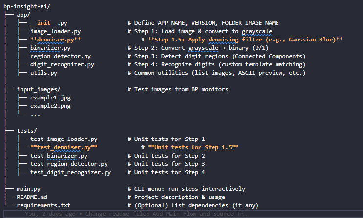

# 🩺 BP Insight AI

BP Insight AI is a lightweight, modular Python application designed to automatically extract blood pressure readings from images of digital monitors (e.g. OMRON, Microlife) using OCR, and diagnose hypertension risk based on standard WHO thresholds.

🔍 **Features:**
- OCR-based text extraction using EasyOCR
- Detection of SYS, DIA, and PUL from noisy medical images
- Rule-based diagnosis logic aligned with WHO classifications
- Gradio web UI for real-time, user-friendly testing
- Modular structure ready for integration with EHR systems or personal health apps

🧠 Designed for:
- Healthcare automation
- Remote monitoring support
- Smart health devices and applications

# Source Tree
bp-insight-ai/
├── app/
│   ├── __init__.py                  # Define APP_NAME, VERSION, FOLDER_IMAGE_NAME
│   ├── image_loader.py              # Step 1: Load image & convert to grayscale
│   ├── **denoiser.py**                  # **Step 1.5: Apply denoising filter (e.g., Gaussian Blur)**
│   ├── binarizer.py                 # Step 2: Convert grayscale → binary (0/1)
│   ├── region_detector.py           # Step 3: Detect digit regions (Connected Components)
│   ├── digit_recognizer.py          # Step 4: Recognize digits (custom template matching)
│   ├── utils.py                     # Common utilities (list images, ASCII preview, etc.)
│
├── input_images/                    # Test images from BP monitors
│   ├── example1.jpg
│   ├── example2.png
│   └── ...
│
├── tests/
│   ├── test_image_loader.py         # Unit tests for Step 1
│   ├── **test_denoiser.py**             # **Unit tests for Step 1.5**
│   ├── test_binarizer.py            # Unit tests for Step 2
│   ├── test_region_detector.py      # Unit tests for Step 3
│   ├── test_digit_recognizer.py     # Unit tests for Step 4
│
├── main.py                          # CLI menu: run steps interactively
├── README.md                        # Project description & usage
└── requirements.txt                 # (Optional) List dependencies (if any)

## Implementation Steps

### **Step 1 – Load & Grayscale**
- **Goal:** Read `.png/.jpg` files and convert them into a grayscale matrix (0–255).
- **Process:**
  - Use `PIL.Image` or manually read pixels.
  - Convert to `'L'` mode (grayscale).
- **Output:** `list[list[int]]` (pixel matrix).
- **Testing:** Check if the file exists and pixel values are within [0, 255].

-- **Details**
# RGB to Grayscale Conversion Example

## 1. Original Image
Suppose you have a 3×3 pixel image with original RGB colors as follows:

| Pixel | R   | G   | B   |
| ----- | --- | --- | --- |
| P1    | 255 | 0   | 0   |
| P2    | 0   | 255 | 0   |
| P3    | 0   | 0   | 255 |
| P4    | 255 | 255 | 255 |
| P5    | 0   | 0   | 0   |
| P6    | 128 | 128 | 128 |
| P7    | 200 | 100 | 50  |
| P8    | 50  | 50  | 200 |
| P9    | 100 | 200 | 100 |

---

## 2. Convert RGB → Grayscale
**Formula**
```
Gray = 0.299*R + 0.587*G + 0.114*B   (luminance formula)
```

**Examples:**
- **P1** (Red) → Gray = `0.299×255 + 0.587×0 + 0.114×0` ≈ **76**
- **P4** (White) → Gray ≈ **255**
- **P5** (Black) → Gray = **0**
- **P6** (Gray 128,128,128) → Gray ≈ **128**

---

## 3. Result Matrix – `list[list[int]]`
After converting all pixels to grayscale values (0–255), the 3×3 image becomes:

```python
[
  [ 76, 150,  29 ],  # Row 1
  [255,   0, 128 ],  # Row 2
  [144,  71, 170 ]   # Row 3
]
```
- Each **row** in the list = one row of pixels in the image.
- Each **integer** = pixel brightness (**0 = black** → **255 = white**). 

---

### **Step 1.5 – Denoising (The "Clean-Up" Step)**

- **Goal:** To reduce or eliminate random "noise" from the grayscale image. This is a critical preparatory step to improve the accuracy of all subsequent stages, especially Otsu's binarization.

- **Why? The "Dirty Valley" Problem**
  Real-world images are messy. They contain random, outlier pixels called **noise** (think of them as "salt and pepper" specks). This noise is a huge problem for Otsu's algorithm.

  Recall that Otsu works by finding the "valley" in the histogram between the two main "mountains" (background and foreground). Noise fills this valley with lots of small, jagged hills, making it "dirty." A dirty valley can confuse Otsu, causing it to pick the wrong threshold.

  **Denoising is the process of "cleaning up" this valley by smoothing out the noise in the image first.**

- **Method: Gaussian Blur (The "Neighborhood Average" Technique)**
  - **Core Idea:** A single pixel should not be drastically different from its immediate neighbors. If it is, it's likely noise. The solution is to make that pixel's value more like the average of its neighborhood.

---

### **A Concrete Example: Removing a "Noise" Pixel**

Imagine we are looking at a tiny 3x3 patch of our grayscale image. The background is dark (values around 50), but a single, bright "noise" pixel with a value of **200** has appeared in the center.

**1. The "Before" Image (Noisy Patch):**

This is what the computer sees as a `list[list[int]]`. The pixel `200` is the outlier.

```
+----+----+----+
| 52 | 50 | 55 |
+----+----+----+
| 48 | 200| 51 |  <-- This pixel is obviously noise.
+----+----+----+
| 53 | 49 | 52 |
+----+----+----+
```

**2. The Denoising Process (Applying a 3x3 "Blurring Window"):**

The Gaussian Blur algorithm slides a 3x3 "window" over the image. When this window is centered on our noisy pixel (200), it does the following:

- **Step A: Look at all 9 pixels in the window:**
  `52, 50, 55, 48, 200, 51, 53, 49, 52`

- **Step B: Calculate a "smart" average (a weighted average):**
  Instead of a simple average, Gaussian Blur gives more importance (weight) to the central pixel and its immediate neighbors. But for simplicity, let's just do a simple average to see the effect:
  
  `Sum = 52+50+55+48+200+51+53+49+52 = 610`
  `Average = 610 / 9 ≈ 68`

- **Step C: Replace the noisy pixel:** The original value `200` is replaced with the calculated average, `68`.

**3. The "After" Image (Denoised Patch):**

The matrix has now been "cleaned."

```
+----+----+----+
| 52 | 50 | 55 |
+----+----+----+
| 48 | 68 | 51 |  <-- The noise is gone! The value is now consistent
+----+----+----+   |     with its neighbors.
| 53 | 49 | 52 |
+----+----+----+
```

**4. The Effect on the Histogram ("Cleaning the Valley"):**

What just happened to our "mountain range" histogram?

- **Before Denoising:** The noisy pixel `200` created a tiny, unwanted "blip" or "hill" on our histogram graph, right in the middle of the valley.
- **After Denoising:** That "blip" at position 200 is now gone. Instead, the count for pixels around 68 has increased by one. The net effect is that we've removed a piece of debris from the valley, making it **cleaner and deeper**.

---

- **Output:** A new grayscale matrix, `list[list[int]]`, with the same dimensions. The output image will appear slightly "softer" or "blurrier" to the human eye, but it is mathematically "cleaner" for the computer.

- **Testing:**
  - **Dimensions:** The output matrix must have the same height and width as the input.
  - **Visual Verification:** This is the most important test. When previewing the output, isolated "salt-and-pepper" dots should be gone or significantly faded. The overall image should look smoother, but the main shapes of the digits should still be clearly recognizable.

---

### **Step 2 – Binarization**

- **Goal:** Convert the (denoised) grayscale image into a binary image (containing only 0s and 1s). This crucial step simplifies the image, allowing subsequent algorithms to distinguish between two fundamental states: "background" and "text/digit".

- **Why?** After denoising, the image is still a complex matrix of 256 possible grayscale values. Binarization removes this complexity, creating a clean, high-contrast image where the shapes of digits are sharply defined. This is essential for accurate region detection and character recognition.

- **Method 1: Fixed Threshold**
  - **Concept:** A simple approach where a single, predetermined value (e.g., 128) is used as a cutoff point.
  - **Formula:**
    ```
    binary_pixel = 1 if grayscale_pixel >= 128 else 0
    ```
  - **Pros:** Extremely fast and easy to implement.
  - **Cons:** Highly ineffective for images with varying lighting conditions. A threshold that works for a brightly lit screen may fail completely for a dimly lit one, causing digit details to be lost.

- **Method 2: Otsu's Threshold (The Adaptive Approach)**
  - **Concept:** This is a "smart" algorithm that doesn't rely on a fixed number. Instead, it analyzes the entire image to **automatically find the optimal threshold** that best separates the pixels into two distinct groups: a "background" group (e.g., the dark LCD screen) and a "foreground" group (e.g., the bright digit segments).
  - **Principle: Maximizing Inter-Class Variance**
    1.  **Build a Histogram:** The algorithm first creates a histogram, which is a graph that counts how many pixels exist for each grayscale level (from 0 to 255). This reveals the distribution of dark and light pixels in the image. A good medical monitor image will typically show two "peaks" on this graph: one for the dark background pixels and one for the bright digit pixels.
        ```
              ^ Pixel Count
              |
              |     ⛰️ (Background Peak)            ⛰️ (Foreground Peak)
              |
              +--------------------(Threshold here?)------------------> Grayscale (0-255)
        ```
    2.  **Test Every Possible Threshold:** The algorithm then iteratively tests every possible threshold `t` from 0 to 255.
    3.  **Calculate a "Separation Score":** For each tested threshold `t`, it divides the pixels into two groups and calculates a score called **"between-class variance"**. This score is a mathematical measure of how "different" the two groups are. The score is highest when the groups are most distinct (i.e., when the threshold is placed in the "valley" between the two histogram peaks).
    4.  **Select the Best:** The threshold that yields the maximum "separation score" is chosen as the optimal threshold for the image.
  - **Pros:**
    - **Adaptive:** Automatically adjusts to the lighting and contrast of each individual image.
    - **Robust:** Provides consistently better results than a fixed threshold across a wide range of photos.
  - **Cons:**
    - Slightly more computationally intensive due to the histogram calculation and iterative search.

- **Output:** A binary matrix `list[list[int]]` where every element is either `0` (e.g., background) or `1` (e.g., digit).

- **Example:**
  - Given a denoised 3x3 grayscale matrix:
    ```python
    [
      [ 76, 150,  29 ],  # Dark, Bright, Dark
      [255,   0, 128 ],  # Bright, Dark, Bright
      [144,  71, 170 ]   # Bright, Dark, Bright
    ]
    ```
  - Otsu's algorithm might analyze this distribution and determine that the best threshold to separate these values is, for example, `t = 100`.
  - The resulting binary image would be:
    ```python
    [
      [ 0, 1, 0 ],
      [ 1, 0, 1 ],
      [ 1, 0, 1 ]
    ]
    ```

- **Testing:**
  - Verify that the output matrix has the same dimensions as the input grayscale matrix.
  - Assert that every value in the output matrix is either 0 or 1.
  - A visual preview is essential to confirm that the digits are clearly legible and not broken, and that the background is clean.

### **Step 3 – Region Detection**
- **Goal:** Identify digit blobs in the binary image.
- **Method:**
  - Traverse the image → group connected `1` pixels (**Connected Components**).
  - Filter by size/ratio (remove noise, keep digits).
  - Sort bounding boxes from left to right.
- **Output:** List of bounding boxes `(x, y, w, h)`.
- **Testing:** Ensure detected regions are reasonable and all bounding boxes are within image bounds.

---

### **Step 4 – Digit Recognition**
- **Goal:** Determine which digit each detected region represents.
- **Method:**
  - **Template matching** (compare against digit templates 0–9).
  - Implement correlation/pixel matching manually, without external AI libraries.
- **Output:** List of digits (SYS, DIA, PUL).
- **Testing:** Compare results with known labeled sample images.

---

### **Step 5 – Evaluation & Diagnosis**
- **Goal:** Provide blood pressure classification (Normal / High / Low).
- **Process:**
  - Read the three values: SYS, DIA, PUL → compare with medical standards.
  - Output classification and alerts.
- **Output:** Diagnostic text.
- **Testing:** Test multiple simulated cases.

---

## 📌 Main Flow (`main.py`)
1. Show menu to select an image from `input_images/`.
2. **Step 1:** Load image → preview grayscale.
3. **Step 1.5:** Denoise image → preview denoised image.
4. **Step 2:** Binarize → preview binary.
5. **Step 3:** Region detection → draw bounding boxes (ASCII or preview).
6. **Step 4:** Recognize digits → print results.
7. **Step 5:** Blood pressure evaluation → print alert.